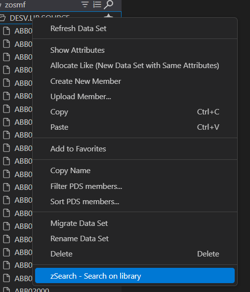
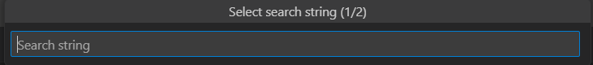
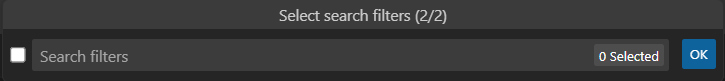
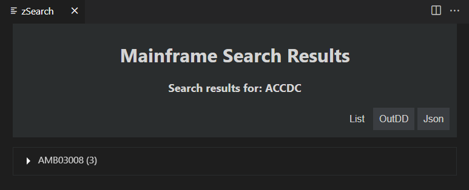
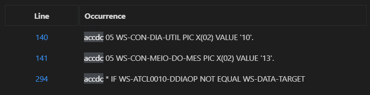
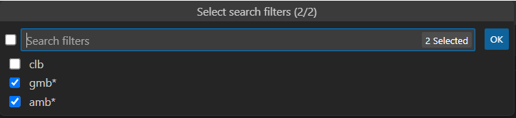

# Mainframe Search README

Search a mainframe library running a _jcl_ with __ISRSUPC__.

## Table of Contents

  - [1. Features](#1-features)
  - [2. Requirements](#2-requirements)
  - [3. Settings](#3-settings)
  - [4. How to...](#4-how-to)
  - [5. Known Issues](#5-known-issues)
  - [6. Release Notes](#6-release-notes)

## 1. Features

1. Search the mainframe for a string
1. Select the library from the Zowe Explorer
1. Filter the search library elements
1. Visualize search results
   1. List of elements
   1. Json
   1. OutDD
1. Showed information
   1. Show line number
   1. Show the line where the search string
1. Opens an item from the search results list in the row where that result is located.
1. highlight the search string
   1. List
   1. OutDD
   1. Json

## 2. Requirements

- [Zowe Explorer](https://marketplace.visualstudio.com/items?itemName=Zowe.vscode-extension-for-zowe) VSCode Extension.
- A zosmf connection profile.
- A valid mainframe UserID.

## 3. Settings

This extension contributes the following settings:

* `zSearch.JobCard.Name`: Job Name to be used on Job Card.

  >__Default value:__ _${USER}S_
  >
  >💡 __Info:__ In the job card the variable _${USER}_ will be replaced by the _userid_ associated with the active _zosmf_ profile.

* `zSearch.JobCard.CLASS`: Class to be used on Job Card.

  >__Default value:__ D

* `zSearch.JobCard.MSGCLASS`: Message Class to be used on Job Card.

  >__Default value:__ X

* `zSearch.PanelPosition`: Select the position where the search results panel will be showned

  >__Possible values:__
  >
  > Active - The currently active column
  >
  > Beside (_Default_) - The column to the side of the active one

* `zSearch.SearchStrings.NumberOfPreviousSearchStrings`: Number of previous search string to list on a quick pick for the selected library

  >__Default value:__ 5
  >
  >__Min Value:__ 0
  >
  >__Max Value:__ 20

* `zSearch.SearchStrings.ListOfPreviousSearchStrings`: A list of previous search string for the selected library. The list is showed on the Search String quick pick

  >__Min items:__ 0
  >
  >__Max items:__ 20

* `zSearch.SearchFilters.NumberOfPreviousSearchStrings`: Number of previous search filters to list on a quick pick for the selected library

  >__Default value:__ 5
  >
  >__Min Value:__ 0
  >
  >__Max Value:__ 20

* `zSearch.SearchStrings.ListOfPreviousSearchStrings`: A list of previous search Filters for the selected library. The list is showed on the Search Filters quick pick

  >__Min items:__ 0
  >
  >__Max items:__ 20

## 4. How to...

1. On the zowe explorer select a library.
2. Expand the library.
3. Right click on the library.
4. Select the __zSearch - Search on library__ menu .

5. Enter the Search string.

   > - A combobox shows the last _Search Strings_ used.
   > - If the active editor has a selected text, the search string input box opens with the selected text as search string.

6. Filter the library elements with the necessary _Filters strings_.

   > - A combobox shows the last _Filter strings_ used.
   > - More than one filter is enabled.

7. On the mainframe a job will be launched.
8. A panel will show the results returned by the job after it's execution as ended.

9.  The result can be visualized as a list, outDD or json:
    1. List - List of elements with the search string:
       1. The list of elements can be expanded tho show the line number em content of the line hiliting the search string.
       2. The line number as a link that will open the element on its respective line.
    2. OutDD - Representation of the sysout element outDD with the search result.
    3. Json - The search results represented as a json object.
10.  The line number on the list opens the selected element at its line.

>
> ### 💡 __Filter Facts:__
>
> 1. Filter can select elements that start or end with a string:
>    1. Start with the alfa-numeric string _aaa_ (example: __'aaa*'__ or __'aaa'__).
>    1. Ends with the alfa-numeric string _aaa_ (example: __'*aaa'__).
>    1. If no filters selected or the __'*'__ selected all elements on the library will be searched.
> 2. More than one filter can selected.
>
> 
---
## 5. Known Issues

n/a
---

## 6. Release Notes

### 1.0.7
- Added Expand and Collapse buttons.

### 1.0.6
- Added the ability to search a string on the results.
- Corrected error on the open file at line functionality

### 1.0.6
- Improved performance.

### 1.0.4
- A historic of the search strings and used filters added.

### 1.0.3
- Correction of the zowe session access.

### 1.0.2
- Correcting the job definition

### 1.0.1
- Initial release of zSearch